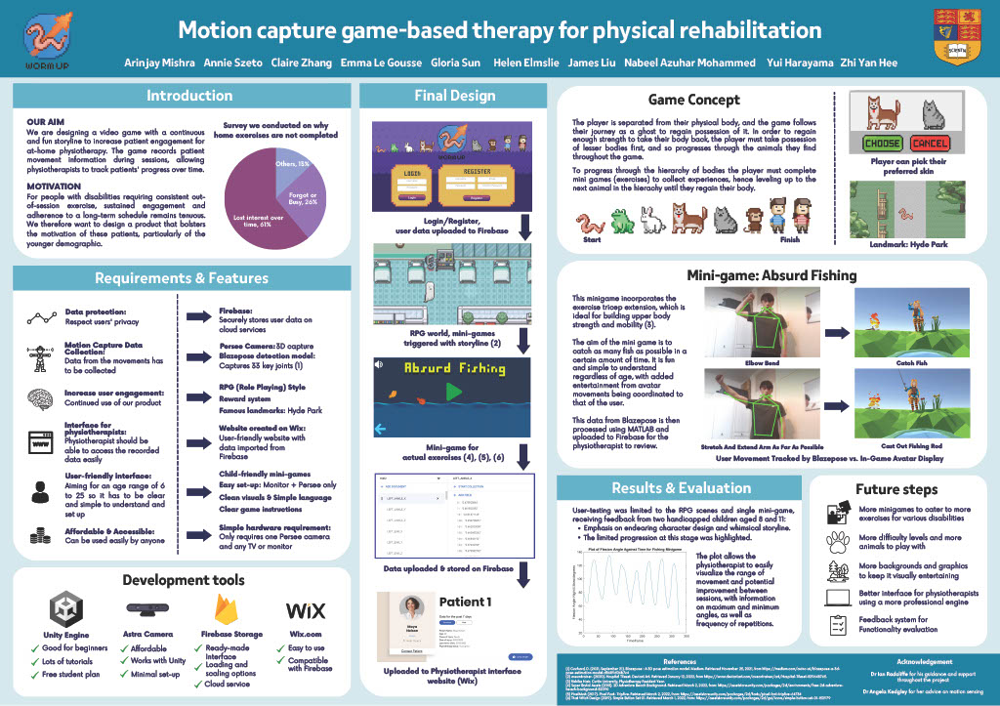

# Worm up: A video game to give people an enjoyable physiotherapy sessions

## Motivation
Welcome to Worm Up: an innovative exergaming solution designed to revolutionize home-based physiotherapy. Recognizing the challenge of patient disengagement with monotonous exercises, we embarked on a mission to create a dynamic rehabilitation experience. Our research revealed a mere 27% adherence to prescribed home-based therapy, motivating us to develop a gamified approach that not only incentivizes consistent effort but also captures valuable movement data for tracking progress.

## Overview
Worm Up, is built in Unity and incorporates the Nuitrack SDK and Astra S 3D camera for skeletal tracking, presenting a captivating RPG-based game. With exercise-based minigames, colourful visuals, and a reward system, it caters to diverse demographics, including children. Featuring animal avatars and familiar UK landmarks, the game ensures an engaging storyline while seamlessly logging physiotherapeutic data, including repetition count, fatigue, pain levels, and goniometric information. Progress indicators such as character level, in-game location, and avatar are automatically recorded in a Google Firebase database, accessible to physiotherapists through our user-friendly Wix website.

Click the links to check out our [poster](assets/BME%20Group%206%20-%20Poster.pdf) and [report](assets/BME%20Group%206%20-Final%20Report%20(submitted%20via%20email%20after).pdf)!

</image>